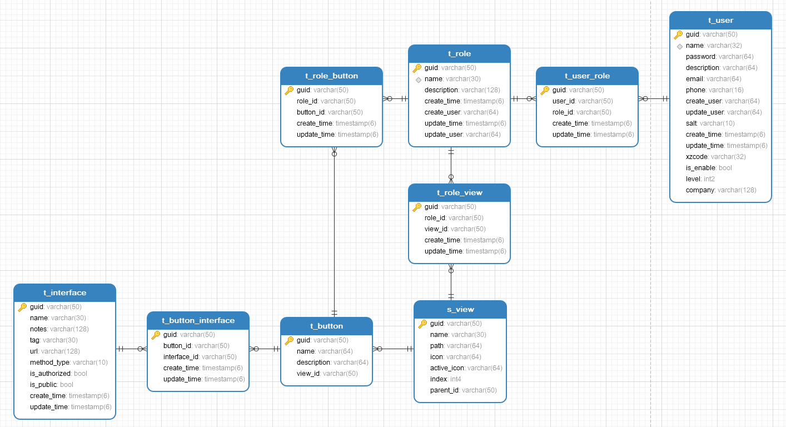

### 这是权限管理模块

##### 不能独立运行，需要引入其他项目中使用

##### 引入此工程的系统，需要在数据库中运行init.sql,并根据实际情况初始化s_view表

##### 依赖此工程的项目需要引入mybatisplus的批量插入insertBatchSomeColumn插件

### 模块表结构

### 功能说明
1. 每个用户可以分配多个角色，每个角色拥有不同的权限，系统维护一个admin用户和admin角色，该角色拥有所有权限,涉及的表为t_user,t_role,t_user_role 
2. 权限分为页面权限，按钮权限和数据权限
3. 页面权限：控制每个角色能够访问的页面，s_view保存页面结构，也就是菜单树结构，每个角色的的页面权限保存在t_role_view表中
4. 按钮权限：控制每个按钮在前端的显示，后台亦会校验该按钮对应的接口是否可以访问，t_button表保存按钮信息，按钮与接口的对应关系保存在t_button_interface表中，角色的按钮权限保存在t_role_button表中
5. 接口信息：系统启动时自动扫描得到，保存在t_interface表中，需要注意的是，所有接口都需要用swagger注解注释可读信息，已方便前端分配权限时使用，对于没有使用swagger注解的接口，将插入方法名和类名，对于开放接口和免鉴权接口，使用@Public、@NoAuthorized注解接口方法
6. 数据权限：表中必须有字段xzcode，对于需要过滤的mapper使用@XzcodeFilter注解，默认所有查询sql都会过滤，除非将方法名加入excludedMethods中，对于自定义的多表查询，如果中间结果包含多个xzcode，为避免歧义需要为主表取别名为dt
7. 系统启动前应该首先为s_view表添加页面信息，为t_button添加按钮信息，为t_button_interface，添加按钮和接口的关系，如果系统其他菜单和按钮还未确定那至少应该添加用户管理和角色管理的相关信息，以保证模块基础功能正常运行
8. 权限控制的原理是，通过返回用户可见页面在前端构建菜单树以保证用户只能看到自己拥有权限的页面，通过配置按钮权限来控制按钮的显隐，通过按钮和接口的对应关系在访问后台接口时校验接口权限，所有接口都在权限管控之下，也就是按钮应该覆盖所有接口，为保证这一点，每个页面隐含一个查看按钮，对应查询接口，对于一些需要开放出去的接口和一些权限不敏感的接口（比如：下拉框数据接口）应该分别用@Public和@NoAuthorized注解接口方法